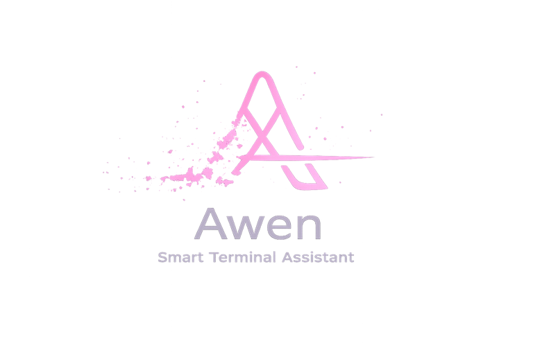
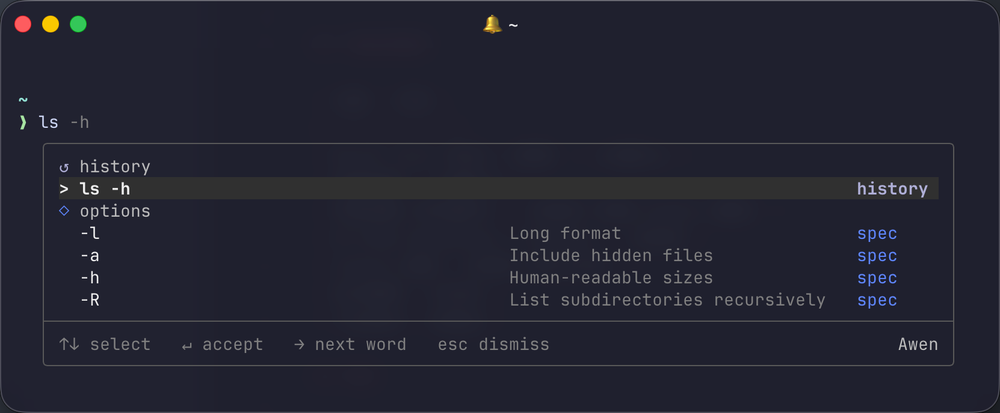

<div align="center">
  
  <h1>Awen</h1>
  <p><b>Terminal Intelligence Layer — Smart when you need it. Silent when you don't.</b></p>
  <a href="https://github.com/zzf2333/Awen/releases"></a>
  <a href="LICENSE"></a>
  <a href="https://github.com/zzf2333/Awen/stargazers"></a>
  <br/>
  <a href="README_CN.md">中文</a>
</div>

<br/>

<div align="center">
  
</div>

<br/>

## Why

Modern terminals are fast but dumb. You repeat the same commands, forget flags, mistype paths, and get cryptic errors. Tools like Warp bundle intelligence into a full terminal — heavy, closed, and opinionated.

Awen takes the opposite approach: a thin daemon that attaches to your existing zsh. Ghost text appears as you type; when a command fails, a fix suggestion shows up; when something is dangerous, a warning flashes. All within **20ms**. AI is available as an async fallback but never required — local-first by design, always offline-capable.

**Always suggests, never executes.** Awen is not a shell agent, not an automation tool, not a terminal emulator. It whispers when you're stuck and disappears when you're not.

The name comes from the Welsh word for "poetic inspiration" — a breeze that arrives uninvited and leaves no trace.

## Features

| Feature | What it does | Speed |
| :--- | :--- | :--- |
| **Ghost Text** | Inline completion from history + command specs | <5ms |
| **Failure Recovery** | Detects 18 error patterns, suggests the fix | instant |
| **Risk Detection** | Warns on 24 dangerous command patterns before you hit Enter | instant |
| **Command Specs** | 77 built-in specs — subcommands, flags, descriptions | <20ms |
| **AI Completion** | DeepSeek / Ollama as async fallback when local isn't enough | async |
| **Natural Language** | Type `# find large files` → get the shell command | async |
| **Context Awareness** | Tracks git state, project type, session history, last exit code | always |

## Install

**Prerequisites:** Rust 1.85+, zsh, jq, socat

```bash
git clone https://github.com/zzf2333/Awen.git
cd Awen
./install.sh
```

This builds the binary, installs it to `~/.local/bin/awen`, copies the zsh plugin and 77 command specs to `~/.config/awen/`, creates a default config, and wires everything into your `.zshrc`. On first launch, your zsh history is auto-imported.

Restart your shell and you're done.

## Usage

### Keybindings

| Key | Action |
| :--- | :--- |
| `→` | Accept full ghost text |
| `Ctrl+→` | Accept next word |
| `↑↓` | Navigate suggestion menu |
| `Enter` | Accept selected suggestion |
| `Esc` | Dismiss |

### Natural Language

Type `#` followed by a description. Awen translates it to a command:

```
# find all go files modified today
```

### CLI

```bash
awen start              # Start daemon
awen stop               # Stop daemon
awen status             # Show status (pid, uptime, history count)
awen logs               # Show recent logs
awen config             # Show configuration
awen context            # Show current context state
awen history import     # Import zsh history
```

## Configuration

Config lives at `~/.config/awen/config.toml`. All fields have sensible defaults.

<details>
<summary>Full configuration reference</summary>

```toml
[ai]
enabled = true                  # Toggle AI completion
provider = "deepseek"           # deepseek | ollama
debounce_ms = 300               # Delay before triggering AI
timeout_ms = 30000              # AI request timeout (async, never blocks input)
max_tokens = 1024               # Max tokens for AI generation
min_local_candidates = 2        # AI triggers only when local results < this
min_local_confidence = 0.6      # AND max confidence < this
cache_ttl_minutes = 30          # Cache TTL for AI responses

[ai.deepseek]
api_key = ""                    # Or set DEEPSEEK_API_KEY env var
model = "deepseek-chat"
base_url = "https://api.deepseek.com"

[ai.ollama]
model = "qwen2.5-coder:7b"
base_url = "http://localhost:11434"

[context]
session_history_size = 20       # Commands to remember in session
stderr_max_chars = 500          # Max stderr length to capture
repo_detect = true              # Auto-detect project type
git_context = true              # Collect git context
capture_stderr = true           # Capture stderr for failure recovery

[ui]
ghost_text_color = 242          # Ghost text color (ANSI 256)
hint_style = "above"            # Hint position: "above" or "below"
dropdown_max_items = 8          # Max items in suggestion menu
risk_detection = true           # Dangerous command warnings
```
</details>

### Custom Specs

User specs in `~/.config/awen/specs/` override built-ins. TOML format:

```toml
[command]
name = "mycli"
description = "My custom tool"

[[command.subcommands]]
name = "deploy"
description = "Deploy to production"

[[command.subcommands.flags]]
name = "--env"
short = "-e"
arg = "ENV"
description = "Target environment"
```

### Custom Failure & Risk Patterns

Add your own patterns in `~/.config/awen/failure_patterns.toml` and `~/.config/awen/risk_patterns.toml`.

<details>
<summary>Built-in command specs (77)</summary>

| Category | Commands |
| :--- | :--- |
| VCS & Dev Ecosystem | `git`, `docker`, `npm`, `cargo`, `brew`, `curl`, `ssh` |
| Cloud & Infrastructure | `gh`, `kubectl`, `terraform`, `aws`, `gcloud`, `az`, `helm` |
| Languages & Runtimes | `python`, `go`, `node` |
| Package Managers | `pip`, `pnpm`, `yarn`, `bun`, `uv`, `poetry`, `cmake`, `make` |
| AI Tools | `claude`, `codex`, `opencode`, `antigravity` |
| File Operations | `ls`, `rm`, `cp`, `mv`, `mkdir`, `touch`, `ln`, `chmod`, `chown` |
| Text Processing | `cat`, `head`, `tail`, `grep`, `sed`, `awk`, `sort`, `uniq`, `wc`, `diff`, `cut`, `tr`, `tee`, `xargs` |
| Search & Archive | `find`, `tar` |
| Process & System | `ps`, `kill`, `df`, `du`, `lsof`, `htop` |
| Networking | `ping`, `dig`, `wget`, `ss`, `nmap` |
| System Administration | `systemctl`, `journalctl` |
| Terminal Multiplexers | `tmux`, `screen` |
| Testing & Linting | `pytest`, `ruff` |
| Task Runners | `just` |
| Database CLIs | `psql`, `mysql`, `redis-cli`, `mongosh`, `sqlite3` |
</details>

## Safety

- **Never executes** — all suggestions require explicit user action
- **Never reads sensitive files** — .env, .ssh, kubeconfig, credentials are off-limits
- **Privacy filtering** — env vars with key/token/secret/password are sanitized; stderr tokens are redacted
- **Offline-capable** — all local features work without network; AI is optional
- **Not an agent** — no file modification, no background tasks, no side effects

## Development

```bash
make dev              # Debug build + sync + restart daemon
make release          # Release build + sync + restart
make test             # cargo test + shellcheck + zsh smoke
make lint             # clippy + fmt check + shellcheck
make sync             # Copy specs/plugin only (no rebuild)
make status           # Check daemon status
make logs             # Show daemon logs
```

<details>
<summary>Project structure</summary>

```
src/
├── main.rs              # CLI entry (clap)
├── daemon.rs            # Unix socket server, request dispatch
├── protocol.rs          # JSON request/response types
├── config.rs            # TOML config with serde defaults
├── pipeline.rs          # AI trigger policy, merge logic
├── arbitrator.rs        # Dedup, context-weight, rank, top-8
├── sanitize.rs          # Privacy filtering
├── context/
│   ├── mod.rs           # Context engine
│   ├── session.rs       # Session history ring
│   ├── git.rs           # Git branch/status
│   └── repo.rs          # Project type detection
└── layer/
    ├── history.rs       # SQLite + nucleo fuzzy match
    ├── specs.rs         # TOML command specs
    ├── ai.rs            # DeepSeek / Ollama providers
    ├── failure.rs       # Stderr → fix suggestion
    ├── risk.rs          # Input → danger warning
    └── history_import.rs
plugin/
└── awen.zsh             # zsh widget (ghost text, menu, hints)
specs/
└── *.toml               # 77 built-in command specs
```
</details>

## Background

Awen follows a few design principles:

- **Whisper, not shout.** Suggestions are ghost text — visible but unintrusive. No popups, no sound, no forced attention.
- **Appear when stuck.** The best tool is the one you forget is running. Awen stays invisible until you hesitate, fail, or reach for something dangerous.
- **Local first, AI second.** History and specs respond in under 5ms. AI is a fallback, not a crutch — and it's fully optional.
- **Exist like air.** A terminal daemon that starts with your shell, uses minimal resources, and disappears when you close it.

## License

MIT
